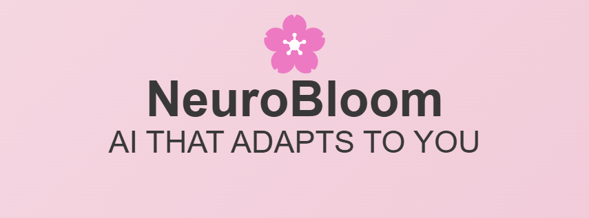

# 🌸 NeuroBloom – AI THAT ADAPTS TO YOU  



## 🚀 About NeuroBloom  
NeuroBloom is an **AI-driven accessibility platform** designed to assist neurodivergent individuals, people with disabilities, and the elderly. It provides an **adaptive UI, AI-powered reading and writing tools, mobility assistance, and productivity enhancements**, making technology more inclusive for all.  

## 🎯 Key Features  

### 🔹 **Adaptive User Interface**  
- **AI-Personalized UI** – Adjusts font size, contrast, and layout based on user needs.  
- **Dyslexia-Friendly Fonts** – Uses OpenDyslexic & readable fonts.  
- **Distraction-Free Mode** – Hides unnecessary UI elements for better focus.  
- **Voice Navigation** – Hands-free interaction via AI voice commands.  

### 🔹 **AI-Powered Reading & Writing Assistance**  
- **AI Text-to-Speech (TTS)** – Reads aloud websites, documents, and emails.  
- **Speech-to-Text (STT)** – Converts spoken words into text.  
- **Immersive Reader** – Enhances readability with text customization.  
- **AI Summarization** – Auto-summarizes long texts for quick reading.  

### 🔹 **Mobility & Visual Assistance**  
- **Smart Screen Reader** – AI-powered voice assistant for visually impaired users.  
- **Gesture-Based Navigation** – Navigate using webcam gestures.  
- **Real-time Captioning** – Auto-generates captions for video/audio.  
- **Sign Language Recognition** – AI interprets sign language to text.  

### 🔹 **AI Productivity & Focus Tools**  
- **Task Prioritization AI** – Suggests important tasks based on deadlines.  
- **Distraction Blocker** – Blocks pop-ups, social media, and unnecessary notifications.  
- **Smart Calendar Assistant** – AI schedules tasks & reminds users.  
- **AI-Powered Note Scanner** – Uses OCR to convert handwritten notes into text.  

### 🔹 **Bonus Features for Elderly Users**  
- **AI Voice Assistant for Seniors** – Helps navigate the web & apps.  
- **Medication Reminders** – AI alerts users for daily medicine schedules.  
- **Fall Detection System** – Uses AI & motion sensors to detect falls.  

## 🛠 Tech Stack  
**Frontend:** React + Tailwind CSS + Javascript
**Backend:** FastAPI (Python)  
**AI & ML:** OpenAI GPT, Google TTS/STT, TensorFlow  
**APIs & Tools:**  
- **Microsoft Immersive Reader API**  
- **Microsoft Graph API** (OneDrive, Outlook, Calendar)  
- **Tesseract OCR** for document scanning  

## 🚀 Getting Started  

### 🔹 **1. Clone the Repository**  
```bash
git clone https://github.com/your-username/NeuroBloom-AI.git
cd NeuroBloom-AI
```
### 🔹 **2. Install Dependencies**  
### Backend (FastApi)
```bash
cd backend
pip install -r requirements.txt
uvicorn main:app --reload
```
### Frontend (React)
```bash
cd frontend
npm install
npm install express
npm install socket.io
```

### 🔹 **3. Run the Application**  
- Open http://localhost:3000/ for the frontend.
- The backend API runs on http://localhost:8000/.

🔹 **4. Run the Chatbox**
```bash
node server.js
```

## 🎨 UI Design & Logo  
Coming soon! Stay tuned for our official design updates. 🎨  

## 🤝 Contributing  
We welcome contributions! Feel free to **open an issue** or **submit a pull request**.  

## 📜 License  
This project is licensed under the **MIT License**. See the [LICENSE](LICENSE) file for details.  

## 🌟 Support & Feedback  
If you have any feedback or feature requests, feel free to **[open an issue](https://github.com/QuantumSadhna/NeuroBloom/issues)** or **contact us**.  
